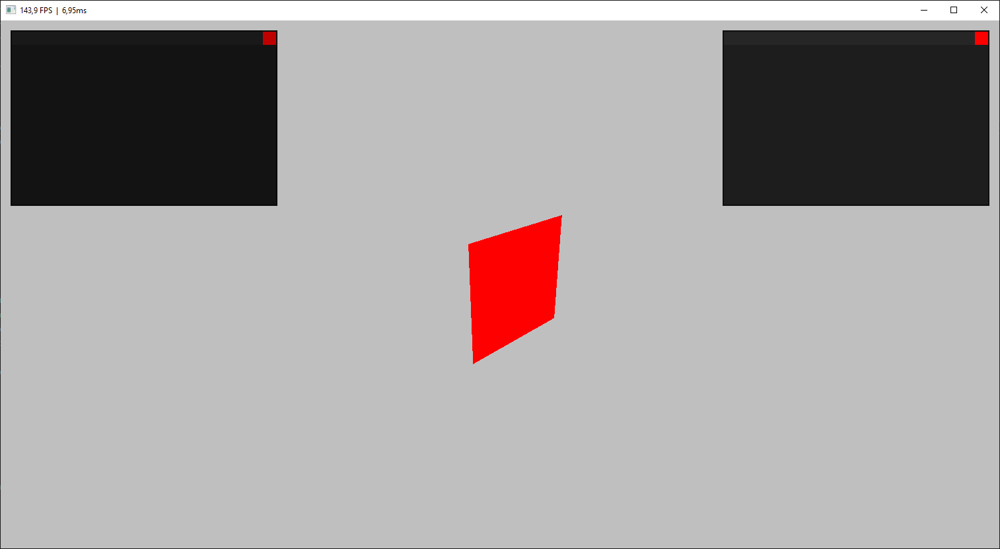

# OpenTK-Template
## A template for creating OpenTK projects
> It saves the window position, size, title and whether it's maximized or not

> WIP lightweight UI

> A simple 3D example can be cloned together with this one

### How to use:
1. Create a folder to hold two projects, the template and the one you will work on
2. Clone this repo, so there is a folder called OpenTK-Template inside the folder from step 1
3. Clone my [3D-Template](https://github.com/Oskis-Poskis/3D-Template) into the folder from step 1, or copy the required functions to create the window and UI

### An example of the folder structure:

