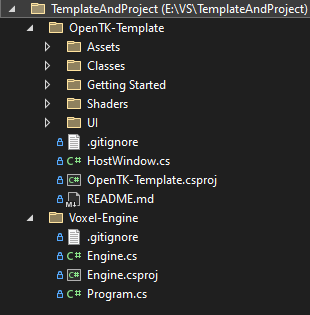

# OpenTK-Template
## A template for creating OpenTK projects
> It saves the window position, size, title and whether it's maximized or not

> Working on some lightweight simple UI as well

### How to use:
1. Create a folder named "Parent Folder"
2. Clone the repo into a new folder named "OpenTK-Template" inside "Parent Folder"
3. Create a folder named "Your Project" inside "Parent Folder"
4. Copy the files from the "Getting Started" folder into "Your Project"
5. Create a .NET Console App inside "Your Project"
6. Reference the template in the new .csproj using:
```xaml
<ItemGroup>
    <ProjectReference Include="..\OpenTK-Template\OpenTK-Template.csproj" />
</ItemGroup>
```

### Example:

